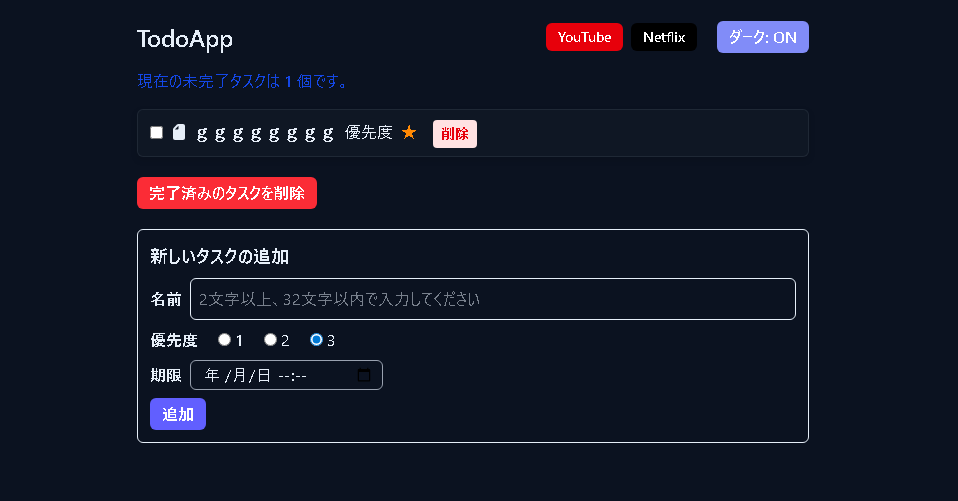
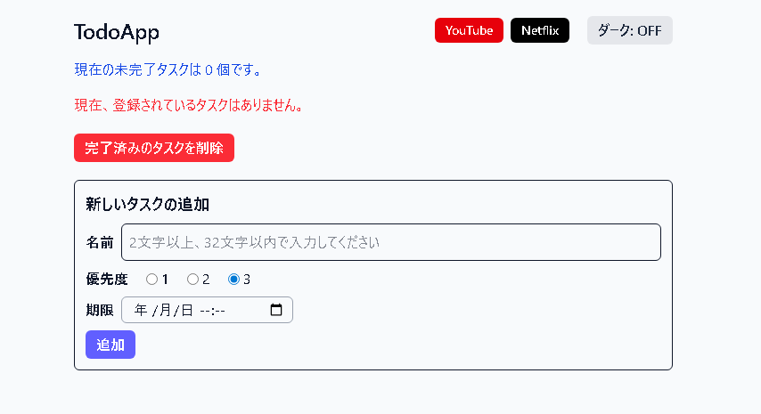
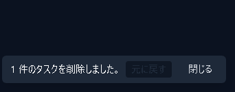

# TodoApp

React、TypeScript、Tailwind CSS を使用し、ローカルストレージでデータを永続化した「Todoアプリ」です。

## URL

- **https://kawt0608.github.io/react-todo2-app2/**

## アプリの機能

- このアプリは`localStorage` にタスクを保存し、更新してもデータが保持されます。
- タスクは「未完了・完了」「優先度」「期限」に基づいて自動でソートされます（未完了 → 優先度高 → 期限が早い順）。
- ダークモードとライトモードの切り替えが可能。
- 「元に戻す」操作が可能な Undo 機能を提供します。
- 画面上部に外部リンク（YouTube、Netflix）。
- 犬が隠れています。

## 技術スタック / 主要ライブラリ

このアプリで使用している主な技術やライブラリは次の通りです。

- **フレームワーク / 言語**: React（v19） + TypeScript
- **バンドラ / 開発ツール**: Vite
- **スタイリング**: Tailwind CSS
- **日付操作**: dayjs
- **ユニーク ID**: uuid
- **アイコン**: Font Awesome（`@fortawesome/react-fontawesome`）
- **ローカル永続化**: ブラウザの `localStorage` を利用（サーバー不要）

パッケージの詳細は `package.json` を参照してください。

## スクリーンショット

以下はアプリの画面イメージです。

<figure style="text-align:center">
 	
 	<figcaption>ダークモード表示</figcaption>
</figure>

<figure style="text-align:center">
 	
 	<figcaption>ライトモード表示</figcaption>
</figure>

<figure style="text-align:center">
 	
 	<figcaption>削除後の Undo </figcaption>
</figure>

<figure style="text-align:center; margin-top:1.6rem;">
  
  <figcaption>サイトを更新したときに 30% の確率でページ背景にこの画像が適用されます</figcaption>
</figure>

## 挑戦・工夫・オリジナリティ

- **ローカル永続化の堅牢化**: `localStorage` に保存した配列が空 (`"[]"`) の場合でも「保存済み」とみなすようにロード処理を調整しました。日付は ISO 文字列から `Date` に戻す処理を追加し、保存と復元の整合性を保っています。
- **Undo（削除取り消し）機能**: タスク削除時に元のインデックスを保持し、画面に 5 秒間トーストを表示して復元できる仕組みを実装しました。ユーザー操作ミスの回復を重視した UX です。
- **優先度・期限ベースの自動ソート**: タスクは「未完了 → 優先度（小さい値が高）→ 期限（早い順）」で自動ソートされます。ユーザーが手動で並べ替えなくても重要なタスクが目に入りやすくなっています。
- **ダークモードの配慮**: CSS 変数を用いてダークテーマ／ライトテーマを切り替え、選択は `localStorage` に保存します。テーマに合わせて UI のコントラストを保つよう工夫しました。
- **ランダム背景（オリジナリティ）**: ページを更新したときに 30% の確率で `stormdog.jpg` が背景に適用されます。背景が濃い場合でも可読性を保つために半透明オーバーレイを重ねています。
- **入力バリデーションと UX 改善**: タスク名は 2〜32 文字でバリデーションを行い、エラー時は視覚的にフィードバックします。追加ボタンの状態制御など小さな配慮を積み重ねています。
- **技術選定の理由（抜粋）**: 開発速度と保守性を重視して `Vite` + `React` + `TypeScript`、スタイリングは `Tailwind CSS` を採用。日付処理に `dayjs`、ID 生成に `uuid` を使用しています。

## 開発履歴

- 2025年10月23日：プロジェクト開始

<!-- 開発期間・ガイダンス（以下は必ず README の末尾付近に表示されます） -->

## 開発期間

- 開発期間: 2025.11.10 ~ 2025.11.19 (約20時間)
